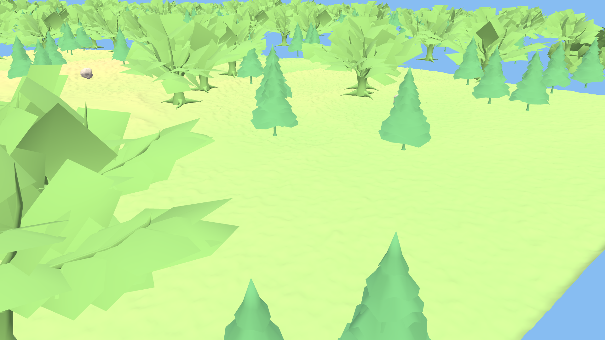

# Visual-Inertial Point-To-Point Navigation with Obstacle Avoidance for Autonomous UGV in Outdoor Environments Using RGB-D and IMU Fusion

Bachelor's thesis. Tested visual SLAM and autonomous navigation on a simulated Clearpath Husky A200 (ROS 2 Jazzy, Gazebo Harmonic, Nav2) and benchmarked ORB-SLAM3, RTAB-Map, and hloc on three public datasets (ROVER, NCLT, Oxford RobotCar / 4Seasons).


*220x150 m outdoor terrain — forest, dirt road, village with buildings*

## Hardware (Simulation Platform)

| Component | Specification |
|-----------|---------------|
| Robot | Clearpath Husky A200, 990 x 670 x 390 mm, 50 kg, 4WD skid-steer |
| RGB-D Camera | Intel RealSense D435i, 640x480 @ 30 Hz, depth 0.1–10 m, 85.2 deg hFoV |
| IMU | Phidgets Spatial 1042, 250 Hz, ±8g accel, ±2000 deg/s gyro |
| LiDAR | Simulated 2D, 360 deg, 12 m range (disabled in SLAM experiments to save GPU) |

## Repository Structure

```
datasets/
  rover/          ORB-SLAM3 evaluation on ROVER UGV dataset (RealSense D435i + T265)
  nclt/           LiDAR ICP odometry + ORB-SLAM3 on NCLT campus dataset (Segway + Velodyne)
  nclt_kaggle/    place recognition with MinkLoc3D on NCLT (Kaggle hackathon pipeline)
  robotcar/       hloc visual localization + ORB-SLAM3 on Oxford RobotCar and 4Seasons
simulation/       Gazebo Harmonic simulation — Husky A200, Nav2, RTAB-Map, ORB-SLAM3
docs/             shared figures and documentation
```

## Experiments and Results

Trajectories compared to ground truth using ATE RMSE (Umeyama alignment).

| # | Dataset | Method | Metric | Result | Notes |
|---|---------|--------|--------|--------|-------|
| 1 | ROVER garden (6 sessions) | ORB-SLAM3 RGB-D | ATE RMSE | 0.37–0.48 m | best: GL/autumn 0.365 m, stable across seasons |
| 2 | ROVER park (5 sessions) | ORB-SLAM3 RGB-D | ATE RMSE | 0.45–6.55 m | worse in open areas, night fails completely |
| 3 | ROVER garden | ORB-SLAM3 Stereo PH | ATE RMSE | 0.53 m | T265 fisheye undistorted to pinhole |
| 4 | 4Seasons office loop | ORB-SLAM3 Stereo-Inertial | ATE RMSE | 0.93 m | best result overall, 99.99% tracking |
| 5 | RobotCar Seasons | ORB-SLAM3 Stereo | ATE RMSE | 3.91 m | 72.7% tracking rate |
| 6 | RobotCar Seasons | hloc (SP + SG + NetVLAD) | correct loc. | 64.5% | map-based, no temporal tracking |
| 7 | NCLT winter | LiDAR ICP + GPS LC | ATE RMSE | 30.2 m | best of 4 seasons, 352 loop closures |
| 8 | NCLT spring/summer/autumn | LiDAR ICP + GPS LC | ATE RMSE | 151–188 m | long routes (3–7 km), drift accumulates |
| 9 | Simulation (forest) | RTAB-Map RGB-D | ATE RMSE | 9.23 m | 269 keyframes, lost tracking on open field |
| 10 | Simulation | ORB-SLAM3 RGB-D | tracking | failed | 505 poses but only 1.2 m coverage, 174 map resets |

Ground truth sources: Leica Total Station (ROVER), RTK GPS + FOG IMU (NCLT), RTK GPS + INS (RobotCar), Gazebo dynamic_pose at 50 Hz (simulation).

## Navigation Pipeline

Point-to-point autonomous navigation tested in Gazebo Harmonic simulation:
- map building with SLAM Toolbox (2D LiDAR) and RTAB-Map (RGB-D)
- Nav2 stack with Regulated Pure Pursuit controller for path following
- obstacle avoidance via local costmap (LiDAR + depth camera)
- web UI for goal setting, live map, and camera feed

Best result: 271 m route through forest → road → village, 98% path efficiency, 0 collisions.

## Pipeline READMEs

- [ROVER](datasets/rover/README.md) — ORB-SLAM3 RGB-D / Stereo / SI on differential-drive UGV with RealSense
- [NCLT](datasets/nclt/README.md) — LiDAR ICP, ORB-SLAM3, DROID-SLAM on Segway campus robot
- [NCLT Kaggle](datasets/nclt_kaggle/README.md) — MinkLoc3D place recognition for loop closure
- [Oxford RobotCar](datasets/robotcar/README.md) — hloc localization + ORB-SLAM3 on autonomous car
- [Simulation](simulation/README.md) — Gazebo Harmonic with Nav2 and visual SLAM

## Quick Start

```bash
git clone https://github.com/vbronetskyi/nclt-slam-project.git
cd nclt-slam-project

# rover pipeline
cd datasets/rover
pip install numpy matplotlib opencv-python evo
# download ROVER data from https://huggingface.co/datasets/iis-esslingen/ROVER
python3 scripts/run_rover_orbslam3.py

# simulation (needs ROS 2 Jazzy + Gazebo Harmonic)
cd simulation
colcon build --symlink-install --packages-select ugv_description ugv_gazebo ugv_navigation
source install/setup.bash
ros2 launch ugv_gazebo full_sim.launch.py headless:=true
# in another terminal:
python3 tools/web_nav.py   # open http://localhost:8765
```

## Known Limitations

- Gazebo uses procedural textures with low feature density — ORB-SLAM3 can't extract enough keypoints on open terrain
- RTAB-Map tracks through forest (close trees = depth discontinuities) but loses tracking on flat grassy areas
- ORB-SLAM3 failed entirely in simulation — 174 map resets, effectively stationary trajectory
- NCLT visual SLAM failed across the board — 5 Hz fisheye camera with no distortion coefficients available
- Real Husky A200 field tests not conducted (hardware access limited to simulation)

## Requirements

- Ubuntu 24.04, Python 3.10+
- ROS 2 Jazzy + Gazebo Harmonic (for simulation)
- ORB-SLAM3 built from source
- NVIDIA GPU recommended for Gazebo camera rendering and hloc feature extraction

## References

### SLAM & Odometry

- **ORB-SLAM3** — Campos et al., 2021, IEEE TRO — [paper](https://arxiv.org/abs/2007.11898) — [code](https://github.com/UZ-SLAMLab/ORB_SLAM3)
- **RTAB-Map** — Labbé & Michaud, 2019, IJRR — [paper](https://doi.org/10.1177/0278364918770436) — [code](https://github.com/introlab/rtabmap)
- **SLAM Toolbox** — Macenski & Jambrecic, 2021, JOSS — [paper](https://doi.org/10.21105/joss.02783) — [code](https://github.com/SteveMacenski/slam_toolbox)
- **DROID-SLAM** — Teed & Deng, 2021, NeurIPS — [paper](https://arxiv.org/abs/2108.10869) — [code](https://github.com/princeton-vl/DROID-SLAM)
- **KISS-ICP** — Vizzo et al., 2023, RAL — [paper](https://arxiv.org/abs/2209.15397) — [code](https://github.com/PRBonn/kiss-icp)

### Visual Localization

- **hloc (Hierarchical Localization)** — Sarlin et al., 2019, CVPR — [paper](https://arxiv.org/abs/1812.03506) — [code](https://github.com/cvg/Hierarchical-Localization)
- **SuperPoint** — DeTone et al., 2018, CVPR Workshop — [paper](https://arxiv.org/abs/1712.07629)
- **SuperGlue** — Sarlin et al., 2020, CVPR — [paper](https://arxiv.org/abs/1911.11763)
- **LightGlue** — Lindenberger et al., 2023, ICCV — [paper](https://arxiv.org/abs/2306.13643) — [code](https://github.com/cvg/LightGlue)
- **DISK** — Tyszkiewicz et al., 2020, NeurIPS — [paper](https://arxiv.org/abs/2006.13566)
- **ALIKED** — Zhao et al., 2023 — [paper](https://arxiv.org/abs/2304.03608)
- **NetVLAD** — Arandjelović et al., 2016, CVPR — [paper](https://arxiv.org/abs/1511.07247)

### Place Recognition

- **MinkLoc3D** — Komorowski, 2021, WACV — [paper](https://arxiv.org/abs/2011.04530) — [code](https://github.com/jac99/MinkLoc3D)
- **AdaFusion** — Lai et al., 2022 — [paper](https://arxiv.org/abs/2208.00243)
- **OpenPlaceRecognition** — [code](https://github.com/OPR-Project/OpenPlaceRecognition)

### Datasets

- **ROVER** — Ligocki et al., Esslingen University of Applied Sciences — [download](https://huggingface.co/datasets/iis-esslingen/ROVER)
- **NCLT** — Carlevaris-Bianco et al., 2016, IJRR — [paper](https://doi.org/10.1177/0278364915614638) — [website](https://robots.engin.umich.edu/nclt/)
- **Oxford RobotCar** — Maddern et al., 2017, IJRR — [paper](https://doi.org/10.1177/0278364916679498) — [website](https://robotcar-dataset.robots.ox.ac.uk)
- **RobotCar Seasons** (benchmark) — Sattler et al., 2018, CVPR — [paper](https://arxiv.org/abs/1707.09092) — [website](https://www.visuallocalization.net)
- **4Seasons** — Wenzel et al., 2020, DAGM GCPR — [paper](https://arxiv.org/abs/2009.06364) — [website](https://www.4seasons-dataset.com)

### Navigation & Frameworks

- **Nav2** — Macenski et al., 2020, IROS — [paper](https://arxiv.org/abs/2003.00368) — [code](https://github.com/ros-navigation/navigation2)
- **ROS 2** — [website](https://docs.ros.org/en/jazzy/)
- **Gazebo Harmonic** — [website](https://gazebosim.org/)
- **evo** — trajectory evaluation — [code](https://github.com/MichaelGrupp/evo)
- **Open3D** — Zhou et al., 2018 — [code](https://github.com/isl-org/Open3D)
- **OpenCV** — [website](https://opencv.org/)
- **COLMAP** — Schönberger & Frahm, 2016, CVPR — [paper](https://arxiv.org/abs/1610.05263) — [code](https://github.com/colmap/colmap)

### Hardware

- **Clearpath Husky A200** — [product page](https://clearpathrobotics.com/husky-unmanned-ground-vehicle-robot/)
- **Intel RealSense D435i** — [product page](https://www.intelrealsense.com/depth-camera-d435i/)
- **Intel RealSense T265** — [product page](https://www.intelrealsense.com/tracking-camera-t265/)
- **Phidgets Spatial 1042** — [product page](https://www.phidgets.com/?prodid=32)
