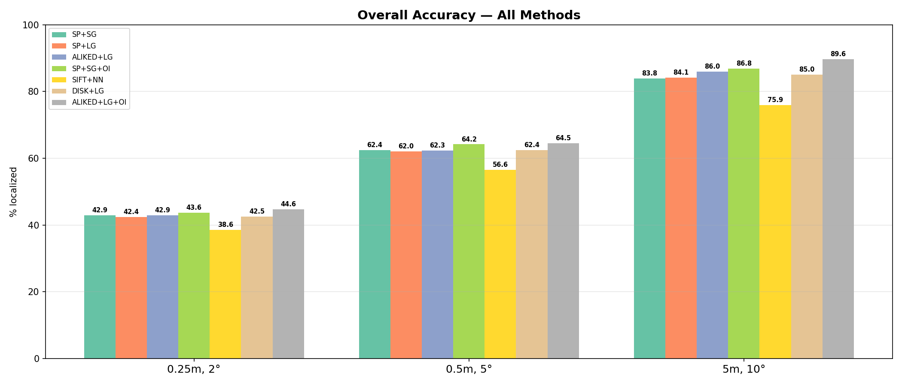
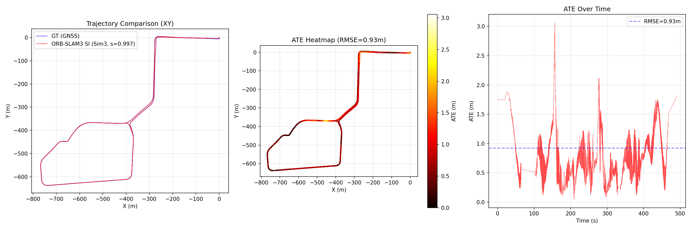

# Visual Localization and SLAM Evaluation Pipeline

## Overview

This repository contains a systematic evaluation of visual localization and SLAM methods on real-world outdoor datasets. The primary goal is to identify approaches that produce accurate, complete trajectories across diverse environmental conditions (varying seasons, weather, and lighting).

Three datasets are used:

- **Oxford RobotCar Seasons** -- a standard benchmark for 6-DoF visual localization under changing conditions
- **4Seasons** -- a multi-season stereo-inertial dataset from TU Munich
- **ROVER** -- a multi-season ground robot dataset with RGB-D and stereo fisheye sensors

Three families of algorithms are evaluated:

- **hloc** (Hierarchical Localization) with various feature detector/matcher/retrieval combinations
- **ORB-SLAM3 Stereo** on Oxford RobotCar
- **ORB-SLAM3 Stereo-Inertial** on 4Seasons

### Results Summary

| # | Method | Dataset | Key Result | Coverage | Notes |
|---|--------|---------|------------|----------|-------|
| 0.7 | hloc (7 configurations) | RobotCar Seasons | 64.5% correct @ 0.5m/5 deg | -- | ALIKED + LightGlue + OpenIBL best |
| 0.8 | ORB-SLAM3 Stereo | RobotCar (full) | ATE 3.91 m | 72.7% | First successful visual SLAM run |
| 0.9 | **ORB-SLAM3 Stereo-Inertial** | **4Seasons office_loop_1** | **ATE 0.93 m** | **99.99%** | **Best result** -- real IMU at 2000 Hz |
| 1.0 | hloc self-test | 4Seasons office_loop_1 | 17.1% @ 0.5m/5 deg | -- | Limited by sparse SfM model |
| 1.1 | ORB-SLAM3 (3 modes) | ROVER (15 recordings) | ATE 0.45 m median (RGB-D) | 73.3% | T265 stereo fails; D435i RGB-D works |

---

## Datasets

### Oxford RobotCar Seasons

The Oxford RobotCar platform is a **Nissan LEAF** equipped with a full sensor suite that drove the same ~10 km route through central Oxford over 100 times across one year (November 2014 -- November 2015).

**Sensor suite:**

| Sensor | Model | Parameters |
|--------|-------|------------|
| Monocular cameras (3x) | Point Grey Grasshopper2 (GS2-FW-14S5C-C) | 1024x1024, global shutter (Sony ICX285 CCD), 11.1 Hz, Sunex DSL315B fisheye 180 deg FOV. Mounted left, right, and rear |
| Stereo camera | Point Grey Bumblebee XB3 | 1280x960, 16 Hz, global shutter, 66 deg FOV, 24 cm baseline. Forward-facing |
| 2D LiDAR (2x) | SICK LMS-151 | 270 deg FOV, 50 Hz, 50 m range |
| 3D LiDAR | SICK LD-MRS | 85 deg x 3.2 deg, 4 planes, 12.5 Hz |
| GPS/INS | NovAtel SPAN-CPT ALIGN | Dual antenna, 6-axis IMU at 50 Hz, GPS + GLONASS |

The RobotCar Seasons benchmark uses only the **3 monocular cameras** (left, rear, right). Images are undistorted and cropped to a pinhole model (fx = fy = 400). The stereo Bumblebee XB3 camera was used separately in the ORB-SLAM3 experiment.

**Benchmark structure:** A 3D map is built from one reference drive (overcast, November 2014), then images from 9 other drives taken under different conditions are localized against it.

| Condition | Date | Challenge |
|-----------|------|-----------|
| overcast-reference | 28 Nov 2014 | Reference map. 20,862 images across 49 locations |
| dawn | 16 Dec 2014 | Low sun angle, long shadows |
| dusk | 20 Feb 2015 | Fading light, headlights appearing |
| night | 10 Dec 2014 | Streetlights only, heavy motion blur |
| night-rain | 17 Dec 2014 | Worst case -- dark, wet, reflections |
| overcast-summer | 22 May 2015 | Vegetation change, different lighting |
| overcast-winter | 13 Nov 2015 | Bare trees, a full year after reference |
| rain | 25 Nov 2014 | Wet roads, droplets, reduced visibility |
| snow | 3 Feb 2015 | Snow cover changes scene appearance |
| sun | 10 Mar 2015 | Hard shadows, glare |

**Dataset statistics:**
- 26,121 reference images (database), of which 20,862 from overcast-reference are used for the 3D map
- 11,934 query images across all 9 conditions
- 3 cameras per location (left, rear, right), 49 non-overlapping locations
- Training split: 1,906 images with known poses
- Test split: 1,872 images (poses withheld, evaluated via visuallocalization.net)

**Evaluation thresholds** (standard on [visuallocalization.net](https://www.visuallocalization.net/)):

| Level | Translation | Rotation | Interpretation |
|-------|-------------|----------|----------------|
| High precision | < 0.25 m | < 2 deg | Suitable for AR applications |
| Medium precision | < 0.5 m | < 5 deg | Sufficient for navigation |
| Coarse precision | < 5 m | < 10 deg | Approximate place recognition |

### 4Seasons

The 4Seasons dataset from TU Munich provides stereo imagery with a high-frequency IMU for evaluating SLAM under seasonal variation. A vehicle drove the same route ("office loop") in spring, summer, and winter.

Unlike RobotCar, 4Seasons includes a **real 2000 Hz IMU** (Analog Devices ADIS16465), enabling proper Stereo-Inertial SLAM evaluation.

| Sensor | Model | Parameters |
|--------|-------|------------|
| Stereo camera | Custom module | 2x 800x400, 30 Hz, global shutter, 30.0 cm baseline |
| IMU | Analog Devices ADIS16465 | 6-axis, 2000 Hz |
| GNSS | Septentrio RTK-GNSS | Ground truth with RTK corrections |

**Key session (office_loop_1, spring):** 15,177 stereo pairs, ~505 s recording, ~1,010,000 IMU measurements, 4,037 GNSS ground truth poses.

### ROVER

The ROVER dataset (iis-esslingen/ROVER on HuggingFace) contains 15 multi-season recordings across 2 locations (garden_large: 8 recordings, park: 7 recordings) captured by a ground robot with Intel RealSense T265 (stereo fisheye 848x800 at 30 fps, IMU at 264 Hz) and Intel RealSense D435i (RGB-D 640x480 at 30 fps). Ground truth is provided by a Leica Total Station.

---

## Experiments

### Experiment 0.7 -- hloc Visual Localization on RobotCar Seasons

**Method:** hloc pipeline (Sarlin et al. 2019) with 7 detector/matcher/retrieval configurations:

1. SuperPoint + SuperGlue + NetVLAD
2. SuperPoint + LightGlue + NetVLAD
3. DISK + LightGlue + NetVLAD
4. ALIKED + LightGlue + NetVLAD
5. SuperPoint + SuperGlue + OpenIBL
6. SIFT + NN-ratio + NetVLAD
7. ALIKED + LightGlue + OpenIBL

**Pipeline:** Feature extraction (4096 keypoints, NMS radius 3, resize 1024) -> global descriptor retrieval (top-20 matches) -> local feature matching -> PnP + RANSAC pose estimation.

**Results (training split, 1,906 images):**

| Method | 0.25m/2 deg | 0.5m/5 deg | 5m/10 deg | Day 0.5m/5 deg | Night 0.5m/5 deg | Med. trans | Med. rot |
|--------|-------------|------------|-----------|----------------|------------------|-----------|----------|
| SP+SG | 42.9% | 62.4% | 83.8% | 71.5% | 30.4% | 0.301 m | 0.782 deg |
| SP+LG | 42.4% | 62.0% | 84.1% | 71.2% | 29.4% | 0.301 m | 0.787 deg |
| DISK+LG | 42.5% | 62.4% | 85.0% | 71.5% | 30.6% | 0.300 m | 0.786 deg |
| ALIKED+LG | 42.9% | 62.3% | 86.0% | 71.2% | 30.9% | 0.297 m | 0.783 deg |
| SP+SG+OI | 43.6% | 64.2% | 86.8% | 71.2% | 39.4% | 0.296 m | 0.761 deg |
| SIFT+NN | 38.6% | 56.6% | 75.9% | 69.6% | 10.7% | 0.367 m | 0.872 deg |
| **ALIKED+LG+OI** | **44.6%** | **64.5%** | **89.6%** | 71.2% | **40.6%** | **0.288 m** | **0.756 deg** |

**Best configuration: ALIKED + LightGlue + OpenIBL** -- 64.5% at (0.5m/5 deg), 40.6% at night.

**Key findings:**
- Learned detectors (SuperPoint, ALIKED, DISK) outperform SIFT by 6--8 percentage points overall
- OpenIBL provides +10% improvement over NetVLAD at night (40.6% vs 30.9%)
- LightGlue matches SuperGlue quality while being faster
- Night localization remains the largest challenge: all methods drop to 30--40% (from 70%+ in daytime), a gap of ~30 percentage points
- SIFT is nearly useless at night (5.6% at 0.5m/5 deg)

### Experiment 0.8 -- ORB-SLAM3 Stereo on RobotCar

**Setup:** ORB-SLAM3 Stereo on Bumblebee XB3 data (1280x960, 16 Hz, 24 cm baseline), session 2014-11-28-12-07-13 (overcast-reference), 6,001 stereo pairs over 420.6 s.

| Metric | Value |
|--------|-------|
| Tracking coverage | 4,365 / 6,001 frames (72.7%) |
| Number of sub-maps | 4 (fragmentation from tracking losses) |
| Ground truth path length | 834.1 m |
| Scale (Sim3) | 0.9658 |
| **ATE RMSE (Sim3)** | **3.91 m** |
| ATE Max | 6.75 m |
| RPE translation/frame | 0.435 m |
| RPE rotation/frame | 0.555 deg |

This was the first successful visual SLAM result in the project. The estimated trajectory follows the ground truth road shape. A Stereo-Inertial attempt failed because the RobotCar dataset does not publish raw IMU data, and synthetic pseudo-IMU derived from INS velocities proved fundamentally incompatible with tightly-coupled visual-inertial optimization.

### Experiment 0.9 -- ORB-SLAM3 Stereo-Inertial on 4Seasons

**Setup:** ORB-SLAM3 Stereo-Inertial on 4Seasons office_loop_1 (800x400 stereo at 30 fps, 30 cm baseline, ADIS16465 IMU at 2000 Hz). Data converted to EuRoC MAV format using a custom converter.

| Metric | Value |
|--------|-------|
| Estimated poses | 3,536 keyframes |
| Matched GT pairs | 3,127 |
| Scale (Sim3) | 0.9967 |
| **ATE RMSE (Sim3)** | **0.93 m** |
| ATE Mean | 0.82 m |
| ATE Median | 0.75 m |
| ATE Max | 3.06 m |
| RPE RMSE | 0.40 m |

**This is the best result across all experiments.** Compared to RobotCar Stereo (3.91 m), the 4x improvement is attributed to:
1. Real 2000 Hz IMU enabling correct pre-integration (vs. no IMU on RobotCar)
2. Larger stereo baseline (30 cm vs. 24 cm) providing better depth estimation
3. Higher frame rate (30 Hz vs. 16 Hz) allowing smoother tracking
4. Near-ideal metric scale (0.997) from stereo + IMU fusion

### Experiment 1.0 -- hloc Self-Test on 4Seasons

**Setup:** hloc with SuperPoint + SuperGlue + NetVLAD/OpenIBL. A 3D map was built from 1,707 subsampled reference images (every 2 m), producing 61,688 triangulated 3D points. Then 7,588 non-reference frames from the same session were localized against this map.

| Metric | SP+SG+NetVLAD | SP+SG+OpenIBL |
|--------|--------------|---------------|
| Localized | 7,588 (100%) | 7,588 (100%) |
| Median translation error | 3.76 m | 3.79 m |
| Median rotation error | 0.98 deg | 0.97 deg |
| 0.25m/2 deg | 12.4% | 12.3% |
| 0.5m/5 deg | 17.1% | 17.2% |
| 5m/10 deg | 55.0% | 55.0% |

The modest accuracy is attributed to the sparse 3D model: only 1,707 of 15,177 frames were used as references, leaving many query locations without sufficient 3D point coverage for reliable PnP estimation. Queries with 200+ PnP inliers achieve 0.59 m median error, while those with fewer than 10 inliers have 163 m median error.

On same-season data, NetVLAD and OpenIBL perform identically (the difference between them emerges only under condition changes).

### Experiment 1.1 -- ORB-SLAM3 on ROVER Dataset

**Setup:** Three ORB-SLAM3 modes tested on all 15 recordings: Stereo (T265 KannalaBrandt8), Stereo-Inertial (T265 + IMU), and RGB-D (D435i pinhole).

| Mode | Success Rate | ATE RMSE Mean | ATE RMSE Median |
|------|-------------|---------------|-----------------|
| Stereo (T265) | 0/15 (0%) | -- | -- |
| Stereo-Inertial (T265) | 0/15 (0%) | -- | -- |
| RGB-D (D435i) | 11/15 (73.3%) | 1.230 m | 0.453 m |

**Key findings:**
- T265 stereo fisheye fails completely in outdoor SLAM -- the 6.35 cm baseline is too narrow for outdoor stereo matching with equidistant fisheye distortion
- Stereo-Inertial cannot recover from stereo initialization failure
- D435i RGB-D is the only viable mode, with consistent results in the garden_large location (mean 0.414 m) and higher variance in the park location (mean 2.208 m, skewed by night outlier at 6.55 m)
- Night conditions degrade RGB-D performance significantly

---

## hloc vs ORB-SLAM3 Comparison

| Characteristic | hloc (localization) | ORB-SLAM3 (SLAM) |
|---------------|---------------------|-------------------|
| Approach | Map-based: query against a pre-built 3D map | Simultaneous mapping and localization |
| Input | Single image (monocular) | Stereo stream (+ optional IMU) |
| Requires pre-built map | Yes (SfM model) | No (builds its own) |
| Cross-season capability | Yes -- localizes across conditions | No -- operates within a single session |
| Best accuracy | 0.288 m median (daytime) | 0.93 m ATE RMSE (Stereo-Inertial) |
| Coverage | 100% (always produces an estimate) | 72.7--99.99% (may lose tracking) |
| Night operation | 40.6% at 0.5m/5 deg (with OpenIBL) | Not tested at night |
| Speed | ~1 s per query (offline) | Real-time |

These address **different tasks**. hloc answers "where am I relative to a known map?", while ORB-SLAM3 answers "how am I moving right now?". In a practical system, the two approaches are complementary.

---

## Key Conclusions

### What works well

1. **ALIKED + LightGlue + OpenIBL** is the best hloc configuration (64.5% at 0.5m/5 deg on RobotCar Seasons)
2. **OpenIBL** provides a critical +10% night improvement over NetVLAD
3. **Learned feature detectors** (SuperPoint, ALIKED, DISK) significantly outperform classical SIFT
4. **LightGlue** matches SuperGlue quality at lower computational cost
5. **ORB-SLAM3 Stereo-Inertial** with a real high-frequency IMU achieves 0.93 m ATE -- the best trajectory accuracy in the project
6. **IMU is a critical component:** the 4x improvement from RobotCar Stereo (3.91 m) to 4Seasons Stereo-Inertial (0.93 m) is primarily due to IMU availability

### What does not work

1. **Night localization** remains the largest unsolved challenge -- all methods drop to 30--40% from 70%+ in daytime
2. **SIFT at night** is effectively useless (5.6% at 0.5m/5 deg)
3. **Pseudo-IMU** synthesized from INS data is fundamentally incompatible with tightly-coupled VIO
4. **T265 stereo fisheye** fails entirely for outdoor SLAM due to its narrow 6.35 cm baseline
5. **Sparse SfM models** severely limit hloc accuracy when reference image density is insufficient

---

## Setup

### Requirements

- Python 3.10+
- [hloc](https://github.com/cvg/Hierarchical-Localization) (`pip install -e .`) for visual localization
- ORB-SLAM3 built at `../third_party/ORB_SLAM3/`
- Xvfb for headless ORB-SLAM3: `apt install xvfb`
- Python packages: `pip install numpy matplotlib opencv-python scipy`

### Download Data

```bash
# Oxford RobotCar Seasons (~161 GB, requires registration)
python3 scripts/download_robotcar_full.py --username USER --password PASS

# 4Seasons (~19 GB)
# download from https://www.4seasons-dataset.com/
```

### How to Run

```bash
# hloc benchmark on RobotCar (7 feature/matcher combinations)
python3 scripts/run_full_benchmark.py

# ORB-SLAM3 Stereo on RobotCar
Xvfb :99 -screen 0 1024x768x24 &
DISPLAY=:99 python3 scripts/evaluate_robotcar_orbslam3.py

# ORB-SLAM3 Stereo-Inertial on 4Seasons
python3 scripts/convert_4seasons_to_euroc.py
bash scripts/run_4seasons_experiment.sh

# generate plots from results
python3 scripts/update_plots.py
```

### Key Result Plots





---

## Directory Structure

```
datasets/robotcar/
├── configs/
│   ├── RobotCar_Stereo.yaml              # ORB-SLAM3 stereo configuration
│   ├── RobotCar_Stereo_Inertial.yaml     # Stereo-Inertial attempt (failed)
│   ├── 4Seasons_Stereo_Inertial.yaml     # ORB-SLAM3 config for 4Seasons
│   ├── ROVER_T265_Stereo.yaml            # ROVER T265 stereo config
│   ├── ROVER_T265_Stereo_Inertial.yaml   # ROVER T265 stereo-inertial config
│   └── ROVER_D435i_RGBD.yaml             # ROVER D435i RGB-D config
├── scripts/
│   ├── run_full_benchmark.py             # hloc ablation study (7 methods)
│   ├── evaluate_robotcar_orbslam3.py     # ORB-SLAM3 trajectory evaluation
│   ├── download_robotcar_full.py         # Data download utility
│   ├── visualize_positions.py            # Position visualization
│   ├── update_plots.py                   # Plot generation
│   ├── convert_4seasons_to_euroc.py      # 4Seasons to EuRoC format converter
│   ├── evaluate_4seasons.py              # 4Seasons trajectory evaluation
│   ├── run_4seasons_hloc.py              # hloc pipeline for 4Seasons
│   ├── run_4seasons_experiment.sh        # Bash orchestrator
│   ├── convert_rover_to_euroc.py         # ROVER to EuRoC converter
│   ├── prepare_rover_rgbd.py             # ROVER RGB-D preparation
│   └── run_rover_orbslam3.py             # ROVER ORB-SLAM3 runner
├── results/
│   ├── robotcar_seasons_hloc/
│   │   ├── all_results.json              # Full results (7 methods x 9 conditions)
│   │   ├── REPORT.md                     # Analytical report
│   │   ├── plots/                        # Visualization plots
│   │   └── submissions/                  # Files for visuallocalization.net
│   ├── robotcar_orbslam3/
│   │   ├── eval_results.json             # ORB-SLAM3 metrics
│   │   ├── trajectory_comparison.png     # Trajectory plot
│   │   └── f_robotcar_stereo.txt         # SLAM trajectory output
│   ├── 4seasons/office_loop_1/
│   │   ├── eval_results.json             # ORB-SLAM3 SI: 0.93 m ATE
│   │   └── trajectory_comparison.png     # Trajectory plot
│   ├── 4seasons_hloc/
│   │   ├── eval_results.json             # hloc: 17.1% @ 0.5m/5 deg
│   │   ├── accuracy_comparison.png
│   │   └── route_error_map.png
│   └── rover/
│       ├── summary.txt                   # ROVER aggregate results
│       ├── all_results.json
│       └── comparison_*.png              # Comparison plots
└── notebooks/
    └── 01_hloc_results.ipynb             # Jupyter analysis notebook

data/robotcar_seasons/                     # ~161 GB
├── images/                                # 10 condition subdirectories
├── 3D-models/all-merged/all.nvm           # Reference SfM model (6.77M 3D points)
├── intrinsics/                            # Camera calibration
├── extrinsics/                            # Camera-to-car transforms
├── robotcar_v2_train.txt                  # Training split (1,906 images)
├── robotcar_v2_test.txt                   # Test split (1,872 images)
└── outputs/                               # hloc outputs (~116 GB)

data/4seasons/                             # ~19 GB
├── calibration/                           # Stereo + IMU calibration
├── office_loop_1/                         # Spring reference session
├── office_loop_4/                         # Summer session
├── office_loop_5/                         # Winter session
└── hloc_outputs/                          # hloc pipeline outputs (~8.6 GB)
```

---

## References

```bibtex
@inproceedings{Sattler2018CVPR,
  author={Sattler, Torsten and Maddern, Will and Toft, Carl and Torii, Akihiko and
          Hammarstrand, Lars and Stenborg, Erik and Safari, Daniel and Okutomi, Masatoshi and
          Pollefeys, Marc and Sivic, Josef and Kahl, Fredrik and Pajdla, Tomas},
  title={Benchmarking 6DOF Outdoor Visual Localization in Changing Conditions},
  booktitle={CVPR},
  year={2018},
}

@article{Maddern2017IJRR,
  author={Maddern, Will and Pascoe, Geoffrey and Linegar, Chris and Newman, Paul},
  title={1 Year, 1000km: The Oxford RobotCar Dataset},
  journal={IJRR},
  volume={36}, number={1}, pages={3-15},
  year={2017},
}

@inproceedings{Sarlin2019CVPR,
  author={Sarlin, Paul-Erik and Cadena, Cesar and Siegwart, Roland and Deschamps, Marcin},
  title={From Coarse to Fine: Robust Hierarchical Localization at Large Scale},
  booktitle={CVPR},
  year={2019},
}

@article{Campos2021TRO,
  author={Campos, Carlos and Elvira, Richard and Rodr\'{i}guez, Juan J. G\'{o}mez and
          Montiel, Jos\'{e} M. M. and Tard\'{o}s, Juan D.},
  title={ORB-SLAM3: An Accurate Open-Source Library for Visual, Visual-Inertial and Multi-Map SLAM},
  journal={IEEE Transactions on Robotics},
  year={2021},
}

@inproceedings{Wenzel2020GCPR,
  author={Wenzel, Patrick and Wang, Rui and Yang, Nan and Cheng, Qing and
          Khan, Qadeer and von Stumberg, Lukas and Zeller, Niclas and Cremers, Daniel},
  title={4Seasons: A Cross-Season Dataset for Multi-Weather SLAM in Autonomous Driving},
  booktitle={GCPR},
  year={2020},
}
```
